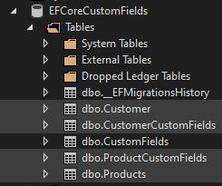
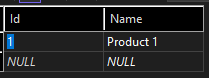
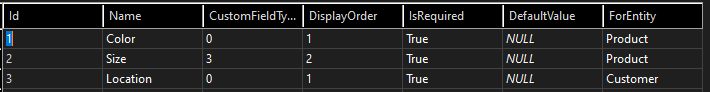

<!-- 
*** This readme is based on https://github.com/othneildrew/Best-README-Template
*** Check them out, it's a great project!
-->
<a name="readme-top"></a>

<!-- PROJECT SHIELDS -->


<!-- PROJECT HEADER -->

# EFCoreCustomFields

<!-- TABLE OF CONTENTS -->

<details>
  <summary>Table of Contents</summary>
  <ol>
    <li>
      <a href="#introduction">Introduction</a>
    </li>
    <li>
      <a href="#getting-started">Getting Started</a>
      <ul>
        <li><a href="#prerequisites">Prerequisites</a></li>
        <li><a href="#package-installation">Package Installation</a></li>
        <li><a href="#database-requirements">Database Requirements</a></li>
      </ul>
    </li>
    <li><a href="#usage">Usage</a></li>
    <li><a href="#roadmap">Roadmap</a></li>
    <li><a href="#contributing">Contributing</a></li>
    <li><a href="#license">License</a></li>
    <li><a href="#contact">Contact</a></li>
    <li><a href="#acknowledgments">Acknowledgments</a></li>
  </ol>
</details>

<!-- ABOUT THE PROJECT -->

## Introduction

Many systems like CRM apps need flexible custom fields that users can tweak. Traditional methods like JSON columns aren't great for performance or type safety.  This library allows you to adopt the Entity Attribute Value (EAV) model allowing you to place custom fields in a child table for the entities. Instead of one huge table for custom fields, this library allows each entity have its own, ensuring better performance and scalability.

<p align="right">(<a href="#readme-top">back to top</a>)</p>

## Features

* Dynamic custom fields per entity
* Improved performance and type safety
* Easy integration with existing EF Core setups

<p align="right">(<a href="#readme-top">back to top</a>)</p>

<!-- GETTING STARTED -->

## Getting Started

Please review the following to get started working with this library.

### Prerequisites

This project uses .NET 8.  For ideal compatibility, your project should also target .NET 8 or higher.

This project depends on Microsoft.EntityFrameworkCore version 8.0.4

### Package Installation

Add a reference to the EFCoreCustomFields NuGet package to the project with your data layer.

### Database Requirements

The sample project, and this documentation, is going to assume a relational database using SQL; specifically, SQL Server in our example.

#### Tables

Essentially, each entity to which you would like to add custom fields will have its own ENTITYCustomFields table.  For example, in the sample application, the Customer and Product entities have their own CustomerCustomFields and ProductCustomFields tables.



You will also have a CustomFields table.  This table will define the custom fields themselves and includes a column to reference the table/entity in which it is used.

Let's look at the Products and ProductCustomFields tables to explain the relationship between an entity, the entity's custom fields table, and the custom fields table itself.

Here's the Products table data:



Here's the ProductCustomFields table data:


Here's the CustomFields table data:



As you can see, the Products table schema is unchanged.  We are not modifying the existing table.  Instead, we have a new ProductCustomFields table and a new CustomFields table.  

The ProductCustomFields table contains a column for each of the supported types (ValueString, ValueNumber, etc.), one of which will not be null.  It also includes a foreign key reference to the CustomField table's Id column and the Product table's Id column.

The CustomFields table defines the individual custom fields and associates them with a type of entity via the ForEntity column, which contains the name of the entity class with custom fields.

If you're not using EF Core Migrations, here's a SQL Script that would set up the sample application database you can use as a reference when setting up your own database:

```sql
BEGIN TRANSACTION;
GO

    CREATE TABLE [Customer] (
        [Id] uniqueidentifier NOT NULL,
        [Name] nvarchar(max) NOT NULL,
        CONSTRAINT [PK_Customer] PRIMARY KEY ([Id])
    );

    CREATE TABLE [CustomFields] (
        [Id] bigint NOT NULL IDENTITY,
        [Name] nvarchar(max) NOT NULL,
        [CustomFieldType] int NOT NULL,
        [DisplayOrder] int NOT NULL,
        [IsRequired] bit NOT NULL,
        [DefaultValue] nvarchar(max) NULL,
        [ForEntity] nvarchar(max) NOT NULL,
        CONSTRAINT [PK_CustomFields] PRIMARY KEY ([Id])
    );

    CREATE TABLE [Products] (
        [Id] bigint NOT NULL IDENTITY,
        [Name] nvarchar(max) NOT NULL,
        CONSTRAINT [PK_Products] PRIMARY KEY ([Id])
    );

    CREATE TABLE [CustomerCustomFields] (
        [Id] bigint NOT NULL IDENTITY,
        [CustomFieldId] bigint NOT NULL,
        [ValueString] nvarchar(2048) NULL,
        [ValueNumber] bigint NULL,
        [ValueDecimal] float NULL,
        [ValueBoolean] bit NULL,
        [ValueDateTime] datetime2 NULL,
        [CustomerId] uniqueidentifier NULL,
        CONSTRAINT [PK_CustomerCustomFields] PRIMARY KEY ([Id]),
        CONSTRAINT [FK_CustomerCustomFields_Customer_CustomerId] FOREIGN KEY ([CustomerId]) REFERENCES [Customer] ([Id])
    );

    CREATE TABLE [ProductCustomFields] (
        [Id] bigint NOT NULL IDENTITY,
        [CustomFieldId] bigint NOT NULL,
        [ValueString] nvarchar(2048) NULL,
        [ValueNumber] bigint NULL,
        [ValueDecimal] float NULL,
        [ValueBoolean] bit NULL,
        [ValueDateTime] datetime2 NULL,
        [ProductId] bigint NULL,
        CONSTRAINT [PK_ProductCustomFields] PRIMARY KEY ([Id]),
        CONSTRAINT [FK_ProductCustomFields_Products_ProductId] FOREIGN KEY ([ProductId]) REFERENCES [Products] ([Id])
    );

    CREATE INDEX [IX_CustomerCustomFields_CustomerId] ON [CustomerCustomFields] ([CustomerId]);

    CREATE INDEX [IX_ProductCustomFields_ProductId] ON [ProductCustomFields] ([ProductId]);

COMMIT;
GO
```

### Entity Framework

Though we are not modifying the existing database tables themselves, we do need to update the entities to which we would like to apply custom fields.  The entity will need to implement the ICustomFieldEntity&lt;T&gt; interface.  

Let's look at Product again as an example.  Here is the EF Core representation of a Product entity:

Before:

```csharp
public class Product
{
    public long Id { get; set; }
    
    public string Name { get; set; } = "";
}
```

After:

```csharp
public class Product : ICustomFieldEntity<Product>
{
    public long Id { get; set; }
    
    public string Name { get; set; } = "";
    
    public static string EntityName => nameof(Product);
    
    public ICollection<CustomFieldValue<Product>> CustomFields { get; set; } 
        = new List<CustomFieldValue<Product>>();
}
```

EntityName provides a consistent way to populate the ForEntity column without relying on hardcoded strings.

CustomFields establishes a 1:many relationship that says 1 product can have many custom fields.

To work with this library, the EF Core entities to which you would like to add custom fields will need to implement the ICustomFieldEntity interface.

You will also need to create DbSet properties and define relationships on the DbContext, as follows in our example:

```csharp
public class AppDbContext : DbContext
{
    public DbSet<CustomField> CustomFields { get; set; }

    public DbSet<Product> Products { get; set; }

    public DbSet<CustomFieldValue<Product>> ProductCustomFields { get; set; }

    public DbSet<Customer> Customer { get; set; }

    public DbSet<CustomFieldValue<Customer>> CustomerCustomFields { get; set; }

    public AppDbContext(DbContextOptions<AppDbContext> options) 
        : base(options) { }

    protected override void OnModelCreating(ModelBuilder modelBuilder)
    {
        modelBuilder.Entity<Product>()
            .HasMany(p => p.CustomFields)
            .WithOne()
            .HasForeignKey("ProductId");

        modelBuilder.Entity<Customer>()
            .HasMany(p => p.CustomFields)
            .WithOne()
            .HasForeignKey("CustomerId");

        base.OnModelCreating(modelBuilder);
    }
}
```

With all of that in place, you are now ready to support custom fields.

<p align="right">(<a href="#readme-top">back to top</a>)</p>

<!-- CONTRIBUTING -->

## Contributions

Feel free to fork the repo, push your changes, and open a pull request. We appreciate your input!

<p align="right">(<a href="#readme-top">back to top</a>)</p>

<!-- LICENSE -->

## License

This project is available under the MIT License. See the LICENSE file for more details.

<p align="right">(<a href="#readme-top">back to top</a>)</p>
